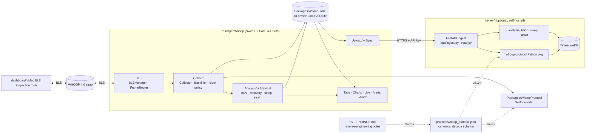

# Architecture

A local-first WHOOP 4.0 client: an iOS app collects, decodes, stores and analyses strap data on-device, and optionally syncs to a self-hosted server. A single protocol schema drives decoding on both sides.

